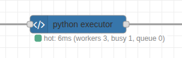

# node-red-contrib-python-executor

Python into your Node-RED flows with a node that feels familiar, stays friendly, and keeps things fast when you need it.



## What You Get
- Run small Python snippets whenever a message arrives.
- Reuse your favorite Python tools without leaving Node-RED.
- Choose between quick start-up or high-speed processing.
- See clear status updates so you always know what is happening.

## Before You Start
- Install Python 3 on the machine running Node-RED.
- Know where your Python interpreter lives (for most systems it is `python3`).

## Node Options
- **Name** – Optional label that appears on the canvas.
- **Python Path** – The command Node-RED should run (for example `python3` or a full path if you use a virtual environment).
- **Timeout** – How long to wait for Python to finish before giving up. Useful to stop code that gets stuck.
- **Python Code** – Your script. It always receives a message named `msg`, and whatever you return is passed along.
- **Hot Mode** – Keeps Python processes running between messages for faster responses.
- **Workers** – How many hot workers to run in parallel (only appears when Hot Mode is on). Use more workers when you expect bursts of messages.
- **Preload Imports** – Optional lines that run once when each hot worker starts. Handy for heavier libraries you do not want to import on every message.

## Cold vs Hot Mode
- **Cold Mode (default)** – Starts a fresh Python process for every message. Great for occasional runs or quick experiments.
- **Hot Mode** – Keeps a pool of Python workers ready. Messages are handled much faster after the first one. Best for frequent or time-sensitive flows.

## Typical Flow
1. Drop the **python executor** node into your flow.
2. Connect an Inject node (input) and a Debug node (output).
3. Add a short script, for example:
   ```python
   msg['payload'] = f"Hello, {msg.get('payload', 'world')}!"
   return msg
   ```
4. Deploy and trigger the flow. Adjust options as needed.

## Context & Warnings
You can read/write Node-RED context from Python and emit warnings:
```python
count = flow_ctx.get("count", 0)
flow_ctx.set("count", count + 1)
node.warn(f"count is now {count + 1}")
return msg
```
- Use `flow_ctx` for flow context and `global_ctx` for global context.
- Context values should be JSON-serializable.

## Working with Images
Rosepetal images travel as a dict `{data, width, height, channels, colorSpace, dtype}`. Two helpers are injected into every node automatically — no import or boilerplate — so you can round-trip through OpenCV/NumPy:

```python
import cv2

img = rp_to_cv(msg["payload"])          # -> BGR uint8 ndarray, ready for cv2
img = cv2.GaussianBlur(img, (7, 7), 0)
msg["payload"] = rp_from_cv(img, like=msg["payload"])
return msg
```

- `rp_to_cv(obj)` returns a NumPy array. RGB/RGBA inputs are reordered to **BGR/BGRA** (OpenCV's convention); grayscale stays 2-D. It honors `colorSpace` and `dtype`, and accepts `data` as raw bytes, a Node Buffer, a list, or base64.
- `rp_from_cv(arr, like=obj)` returns a Rosepetal image dict. The array is assumed BGR and reordered back to RGB. Pass the source dict as `like=` to preserve its `colorSpace` label.
- `data` comes back as raw bytes, so it rides the shared-memory fast path in hot mode (no base64 bloat).
- Both helpers work in hot **and** cold mode. Library imports do not: cold mode starts a fresh interpreter per
  message, so `import cv2` belongs at the top of your code and **Preload Imports** applies to hot mode only.
  Re-importing numpy + OpenCV costs roughly 100 ms per message, so use hot mode for image work.

## Benefits At A Glance
- **Familiar:** Works just like the standard function node, only in Python.
- **Flexible:** Supports both simple scripts and larger libraries.
- **Fast:** Hot mode cuts response time dramatically for repeat work.
- **Clear:** Status messages and notifications help you see what is working and what needs attention.
- **Binary Friendly:** Hot workers stream large Buffers through shared memory instead of JSON, so images and other blobs stay fast.

## Handling Large Binary Payloads
- Hot workers stream Buffers to Python as raw bytes inside the worker's binary frame protocol, so image data never touches JSON or base64 and never hits the filesystem.
- Python can return `bytes`, `bytearray`, or `memoryview`; they come back the same way and Node converts them to Buffers automatically. This also applies in cold mode.
- The optimization is automatic—just enable hot mode when you expect heavy binary traffic.
- Set `ROSEPETAL_PY_INLINE_MAX_BYTES=<bytes>` in Node-RED's environment to route buffers at or above that size through a `/dev/shm` file instead of the pipe (measured slower on Linux, but available if your platform prefers it).

## Performance Notes (hot mode)
The hot path is built to stay off Node-RED's event loop and to cost as little as possible per message:
- One binary frame per direction (`u32 length | JSON header | raw blobs`). Nothing is base64-encoded, no temporary files are written, and the user code is shipped to each worker once and cached by id.
- The message is walked once, copy-on-write, so a message without Buffers costs zero allocations before `JSON.stringify`.
- Nothing awaits: for a normal message the whole Node side of a round trip is synchronous work of a few microseconds; there are no promises created per key or per value.
- Node status updates are coalesced (at most one every 50 ms per node) so the editor websocket and Status nodes are not flooded at high message rates. The texts are unchanged: `hot: running`, `hot: 3ms`, `hot: ready`.
- Workers start with glibc malloc thresholds pinned (`MALLOC_MMAP_THRESHOLD_`, `MALLOC_TRIM_THRESHOLD_`, `MALLOC_TOP_PAD_`) so multi-megabyte image buffers are reused from the heap instead of being page-faulted in on every message. Set `ROSEPETAL_PY_MALLOC_TUNING=0` to disable, or set the variables yourself to override.
- `rp_to_cv` / `rp_from_cv` use `cv2.cvtColor` for the RGB↔BGR swap when OpenCV is installed (about 100x faster than the NumPy reversed view on a 720p frame; identical bytes).
- `print()` inside hot-mode code goes to the worker's stderr (visible in the Node-RED log) and can no longer corrupt the worker protocol.

Typical round trips measured on a laptop (Node-RED → Python → Node-RED, one worker): a small dict in ~0.1 ms, a 200-item JSON payload in ~0.5 ms, a 16 KB buffer in ~0.13 ms, a 1280×720 RGB image through `rp_to_cv`/`rp_from_cv` in ~3 ms. The remaining floor for tiny messages is the two process wake-ups of a pipe round trip; on a machine with the `powersave` CPU governor those wake-ups are noticeably slower than with `performance`.

Enjoy mixing Python logic into your Node-RED projects without extra fuss. When you are ready for more performance, flip on Hot Mode and keep building.
